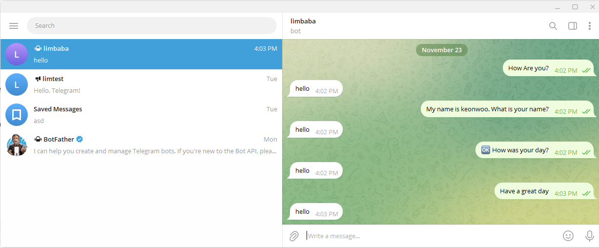

## 🚀 Telegram_bot & ChatGPT 연동하기

- **2번 과제에 개설한 봇과 연동하기!**
- 참고 (https://www.linkedin.com/pulse/chatgpt-telegram-bot-dasaraju-abhishek-varma) 감사합니다.
- 저는 카드 정보를 OpenAI에 제시하지 않고 사용자가 채팅을 치면 별도의 문자가 전달되도록 코드를 작성했습니다.

## 🛠️ 결과

### 사용한 코드

[chatgpt.py](./chatgpt.py)

### 결과 이미지

</img> 

